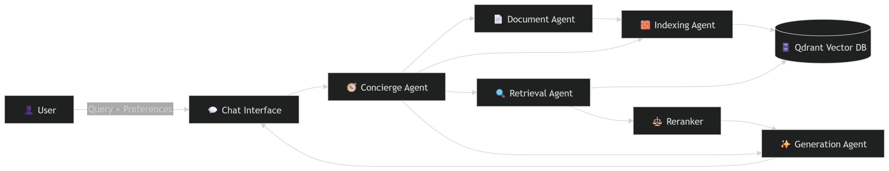
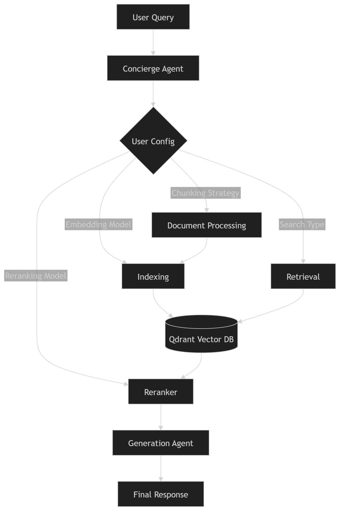
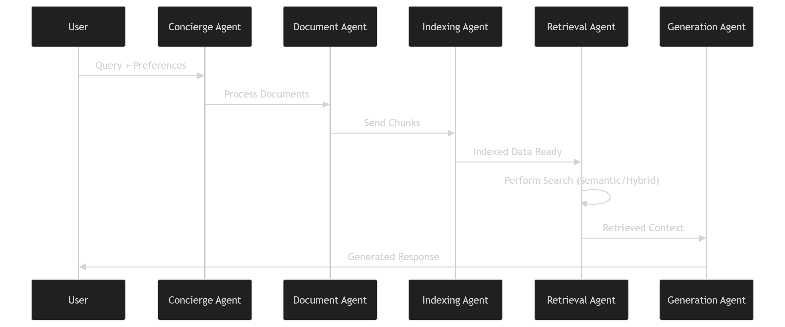

# User-Centric RAG using LlamaIndex Multi-Agent System & Qdrant

---

## 📖 Overview

Have you ever used a RAG application and thought:

* *“What if I could switch from semantic to hybrid search for this query?”*
* *“Maybe a different reranking or embedding model would give better results.”*

Typically, making such changes requires modifying the codebase. But what if you could simply **ask an agent to handle everything within the chat interface?**

This project introduces **User-Centric RAG** — a multi-agent system built using the **LlamaIndex Multi-Agent Concierge architecture**, enabling dynamic control over the entire RAG pipeline.

---

## 🚀 Key Idea

Instead of hardcoding pipeline decisions, this system allows users to:

* Select **chunking strategies**
* Choose **embedding models**
* Switch between **semantic and hybrid search**
* Apply different **reranking models**

👉 All through a **simple conversational interface**

---

## 🧠 Project Summary

This project demonstrates how a **LlamaIndex Multi-Agent System** transforms a traditional RAG pipeline into a **fully user-controllable system**.

Each stage of the pipeline is handled by specialized agents:

* 📄 **Document Processing Agent** → Handles chunking & preprocessing
* 🧱 **Indexing Agent** → Builds vector indexes
* 🔍 **Retrieval Agent** → Executes semantic or hybrid search
* ✨ **Generation Agent** → Produces final responses

This modular, agent-driven design enables users to tailor the system dynamically based on their needs.

---

## 🏗️ Architecture

---

---

---

## 📊 Results & Observations

The system demonstrates strong flexibility by allowing real-time experimentation with different configurations:

### 🔹 Experiment 1

* **Search Type:** Semantic Search
* **Reranker:** BGE Model
* ✅ Optimized for semantic relevance

### 🔹 Experiment 2

* **Search Type:** Hybrid Search
* **Reranker:** Cross-Encoder
* ✅ Balanced semantic + keyword matching

Both queries were executed **without modifying the code**, highlighting the system’s adaptability and user-centric design.

---

## 📚 References

* https://qdrant.tech/documentation/
* https://docs.llamaindex.ai/en/stable/
* https://www.llamaindex.ai/blog/building-a-multi-agent-concierge-system

---

## 🔮 Future Enhancements

* Add automated evaluation metrics (RAGAS, etc.)
* Integrate more embedding & reranking models
* Deploy as a scalable API service
* Add UI dashboard for configuration visualization
