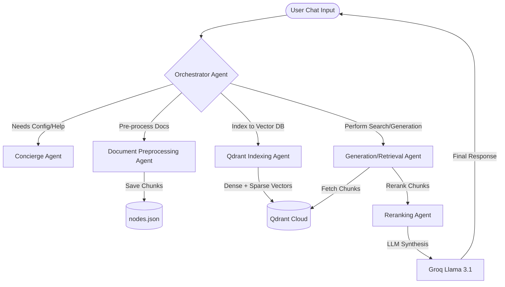

# User-Centric RAG using LlamaIndex Multi-Agent System & Qdrant

This repository contains a **Conversational Multi-Agent RAG System** built using **LlamaIndex**, **Qdrant Vector Database**, and **Groq Cloud API**. Unlike static RAG pipelines where configurations are hardcoded, this system allows users to dynamically configure chunking, embeddings, retrieval strategies, and reranking parameters entirely via a Streamlit chat interface.

---

## 🏗️ System Architecture

Each step of the RAG pipeline is managed by specialized, autonomous agents that communicate and transition states under the direction of an Orchestrator:



### Specialized Agents:
1. **Orchestrator Agent:** Watches the conversation history and updates state variables, delegating to the appropriate active agent.
2. **Concierge Agent:** Handles default user communication, clarifying options, and collecting missing configurations.
3. **Document Preprocessing Agent:** Performs text sanitization, sentence splitting, and chunk formatting.
4. **Qdrant Indexing Agent:** Generates dense and sparse embeddings (SPLADE/BM42 attentions) and registers them to Qdrant.
5. **Retrieval & Generation Agent:** Combines retrieval strategies, cross-encoder rerankers, and LLM text generation to answer user queries.

---

## 🛠️ Getting Started & Local Setup

### 1. Prerequisites
Ensure you have **Python 3.10+** installed. Clone the repository and install the project requirements:
```bash
pip install -r requirements.txt
```

### 2. Configure Environment Secrets
Create a `.env` file at the root of the project (template available in `.env`) and add your API credentials:
```ini
# Groq LLM Configuration
GROQ_API_KEY=your_groq_api_key
GROQ_MODEL=llama-3.1-8b-instant

# Qdrant Database Configuration
QDRANT_URL=your_qdrant_cluster_url
QDRANT_API_KEY=your_qdrant_api_key
QDRANT_COLLECTION_NAME=rag_collection
```

### 3. Run the App
Launch the Streamlit web interface locally:
```bash
streamlit run src/app.py
```

---

## 🎛️ How to Tune Your RAG Pipeline via Conversation

The system holds a session state mapping your configurations. You can adjust and tune parameters conversationally at each pipeline stage:

| Stage | Configurable Parameters | How to Ask the Agent |
| :--- | :--- | :--- |
| **1. Chunking** | `chunk_size` (e.g. 300, 500, 800)<br>`chunk_overlap` (e.g. 50, 100) | *"Preprocess with a chunk size of 500 and chunk overlap of 50"* |
| **2. Embeddings** | `embedding_model`<br>Options: `sentence-transformer`, `snowflake`, `BAAI` | *"Index using the BAAI embedding model"* |
| **3. Retrieval** | `search_type`<br>Options: `semantic` (dense only) or `hybrid` (RRF dense + sparse) | *"Query using hybrid search"* |
| **4. Reranking** | `reranking_model`<br>Options: `cross-encoder` or `BGE` | *"Use the cross-encoder reranker"* |

---

## 💬 Step-by-Step Interactive RAG Guide

Follow this walkthrough to index and query your uploaded document:

### Step 1: Upload Documents
In the Streamlit left sidebar, upload your documents (`PDF`, `TXT`, `DOCX`, or `JSON` formats). This writes them dynamically to a sandbox folder and configures your session's `input_dir`.

### Step 2: Split and Preprocess
Instruct the agent to split the document into chunk nodes:
> **User:** *"Preprocess the uploaded files with a chunk size of 400 and overlap of 40"*
> 
> *The Document Preprocessing Agent will activate, split the documents, and save the schema to the sandbox.*

### Step 3: Index Chunks to Qdrant Cloud
Push the nodes with dense & sparse vector configurations to your database:
> **User:** *"Index the nodes using the sentence-transformer embedding model"*
> 
> *The Indexing Agent will create the collection in Qdrant (with dual dense/sparse indexing structures) and upsert the vectors.*

### Step 4: Hybrid RAG Query & Synthesis
Query the knowledge base using advanced search & reranker settings:
> **User:** *"Query the document to extract the candidate's main technical experiences using hybrid search type and BGE reranker"*
> 
> *The Orchestrator routes the request to the Generation agent. The agent fetches the top chunks from Qdrant, merges the dense and sparse scores, filters through the BGE reranker, and outputs the result using Groq.*

---

## 📚 Technical Abstractions Used
* **LlamaIndex Workflows:** Underpins the agent communication loop, routing context, and session memory management.
* **FastEmbed:** Generates dense vector representations and SPLADE sparse representations on the fly.
* **Qdrant Client:** Executes fast vector search with Reciprocal Rerank Fusion (RRF) for hybrid retrieval.
* **Sentence-Transformers:** Reranks candidate nodes using Cross-Encoder models to maximize precision.
